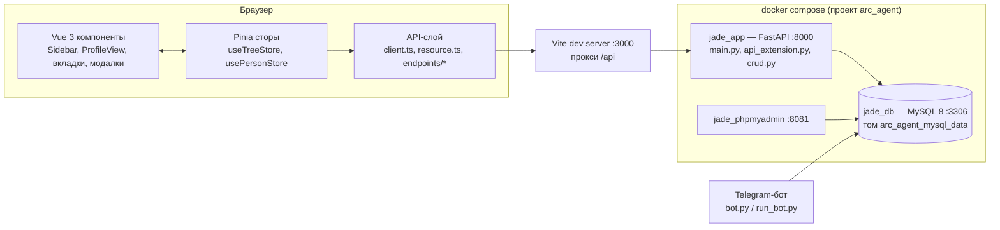
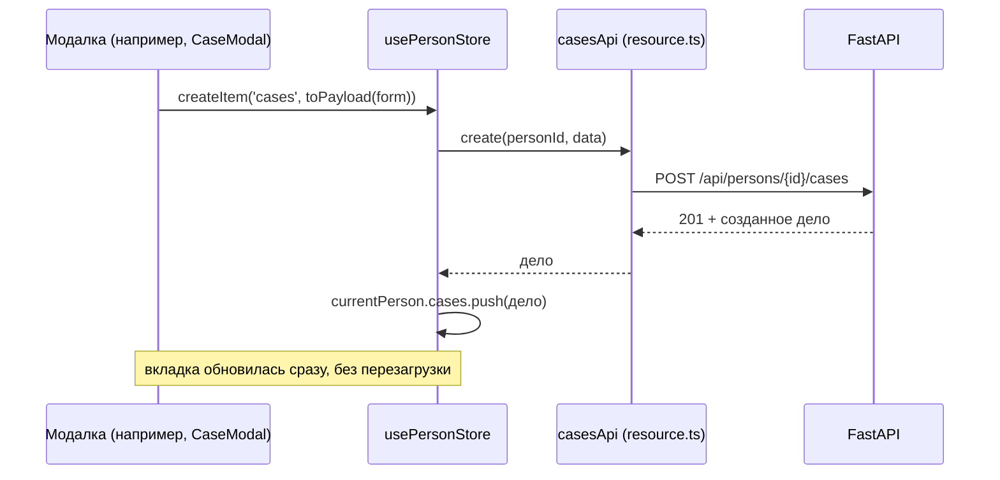

# Архитектура

## Компоненты

| Компонент | Где | Подробнее |
|---|---|---|
| Интерфейс | `frontend/` — Vue 3, Pinia, Vite, Axios | [frontend.md](frontend.md) |
| API | `backend/` — FastAPI, SQLAlchemy 2, Pydantic 2 | [backend.md](backend.md), [api.md](api.md) |
| База | MySQL 8, utf8mb4 | [data-model.md](data-model.md) |
| Запуск и выпуск | docker compose, GitHub Actions, GHCR | [deployment.md](deployment.md) |

## Поток данных при изменении (реактивный CRUD)

Правила (решение — [ADR-001](decisions/ADR-001-reactive-stores.md)):

- Сервер — источник правды; стор меняется **ответом** сервера, а не повторной загрузкой.
- Удаление оптимистичное: запись исчезает сразу, при ошибке возвращается на место.
- Связи в профиле — производный вид, поэтому после изменения перечитывается только их список.
- Ответ на устаревший запрос профиля отбрасывается; спиннер — только при смене человека.
- Список людей в боковой панели (`useTreeStore`) обновляется точечно: `upsertPerson`,
  `removePerson`, `upsertRelation`, `removeRelation`.

## Порты

| Порт | Что |
|---|---|
| 3000 | Vite dev server (интерфейс), проксирует `/api` → 8000 |
| 8000 | API (`jade_app`), Swagger: `/docs` |
| 3306 | MySQL (`jade_db`) |
| 8081 | phpMyAdmin |

Все порты Docker сейчас открыты на `0.0.0.0` — см. [security.md](security.md).
