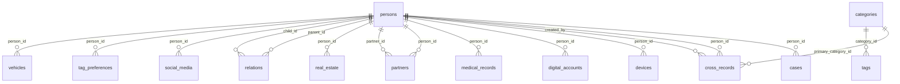

# Модель данных

Сгенерировано из метаданных SQLAlchemy (`backend/models.py`). База — MySQL 8, кодировка utf8mb4.
Таблицы создаёт `init_db()` при старте API (`create_all` создаёт только отсутствующие таблицы, существующие не меняет).

| Таблица | Колонок | Внешние ключи | Мягкое удаление | Колонки |
|---|---|---|---|---|
| `categories` | 8 | — | нет | id, name, slug, icon, color, description, created_at, updated_at |
| `persons` | 44 | — | нет | id, full_name, short_name, photo_path, birth_date, gender, address, phone, email, height, weight, clothing_size, shoe_size, chest_size, waist_size, hip_size, blood_type, rh_factor, allergies, chronic_diseases, medications, blood_pressure, heart_rate, passport_number, inn, snils, driver_license_category, driver_license_number, marital_status, children_count, education, profession, workplace, favori… |
| `cases` | 10 | person_id→persons | нет | id, person_id, case_type, title, description, priority, status, due_date, created_at, updated_at |
| `cross_records` | 16 | person_id→persons, primary_category_id→categories, created_by→persons | нет | id, person_id, title, description, record_type, primary_category_id, data, record_date, start_date, end_date, status, importance, is_private, created_by, created_at, updated_at |
| `devices` | 19 | person_id→persons | да | id, person_id, device_type, brand, model, color, specs, imei, serial_number, purchase_date, purchase_price, purchase_place, warranty_until, accessories, condition, notes, is_active, created_at, updated_at |
| `digital_accounts` | 27 | person_id→persons | да | id, person_id, platform_type, platform_name, username, email, phone, password, backup_codes, security_questions, account_id, uid, user_id, friend_code, server_id, server_name, region, nickname, server, level, rank, guild, characters, notes, is_active, created_at, updated_at |
| `medical_records` | 10 | person_id→persons | нет | id, person_id, record_type, title, description, record_date, doctor_name, attachments, created_at, updated_at |
| `partners` | 15 | person_id→persons, partner_id→persons | нет | id, person_id, partner_id, relationship_type, relationship_status, relationship_label, start_date, end_date, breakup_reason, emotional_connection, physical_connection, relationship_rating, relationship_notes, created_at, updated_at |
| `real_estate` | 29 | person_id→persons | да | id, person_id, property_type, property_name, address, total_area, living_area, land_area, floor, total_floors, rooms_count, bathroom_count, balcony_count, ownership_type, ownership_percent, cadastral_number, registration_date, purchase_price, current_value, mortgage_bank, mortgage_amount, mortgage_left, condition, year_built, renovation_year, notes, is_active, created_at, updated_at |
| `relations` | 6 | parent_id→persons, child_id→persons | нет | id, parent_id, child_id, relation_type, created_at, updated_at |
| `social_media` | 6 | person_id→persons | нет | id, person_id, platform, link, created_at, updated_at |
| `tag_preferences` | 5 | person_id→persons | нет | id, person_id, category, value, created_at |
| `tags` | 8 | category_id→categories | нет | id, name, slug, category_id, description, color, created_at, updated_at |
| `vehicles` | 37 | person_id→persons | да | id, person_id, vehicle_type, brand, model, year, color, license_plate, vin, engine_number, chassis_number, engine_capacity, horsepower, mileage, transmission, drive_type, fuel_type, ownership_type, registration_date, registration_number, purchase_price, current_value, loan_bank, loan_amount, loan_left, insurance_company, insurance_policy, insurance_until, osago_until, last_maintenance, next_mainte… |

## Особенности

- Удаление человека каскадно удаляет его записи во всех таблицах (`ON DELETE CASCADE`).
- `relations` — направленная связь `parent_id → child_id`; в профиле API отдаёт производный вид
  (`direction`, `person_name`, `person_id`).
- `cross_records.data` — JSON произвольной структуры; категория обязательна при создании,
  категорию с записями удалить нельзя (`400`).
- `digital_accounts.password`, `backup_codes`, `security_questions` хранятся **открытым текстом** —
  см. [security.md](security.md).
